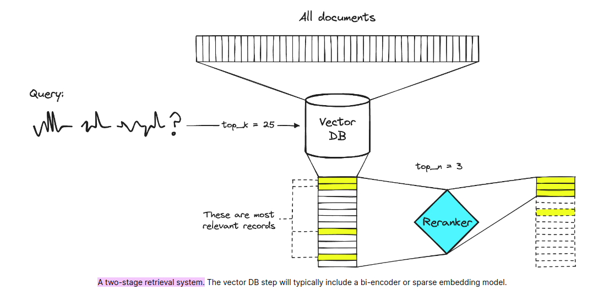

## RAPTOR: Recursive Abstractive Processing for Tree-Organized Retrieval

<picture>
  
</picture>

Этот проект упрощает процесс извлечения и запроса информации из сложных PDF-документов, включая сложный контент, такой как текст, таблицы, графики и изображения. Используя современные модели обработки естественного языка и Unstructured.io для парсинга документов, система применяет Cohere Reranker для улучшения точности и релевантности поиска информации. Cohere Reranker уточняет начальные результаты поиска, чтобы гарантировать, что наиболее важная информация будет приоритетной.

Затем система интегрирует RAPTOR, который представляет собой новый подход к языковым моделям с поддержкой извлечения, строя рекурсивную структуру дерева из документов. Этот метод позволяет более эффективно и контекстно осведомленно извлекать информацию из больших текстов. Дополнительно используется Raptor Rag для извлечения семантических блоков, что дополнительно улучшает результаты поиска. Чат-бот таким образом предоставляет удобный интерфейс для взаимодействия с этими документами и извлечения из них подробной информации.

## Re-Ranker

Прежде чем перейти к решению, давайте поговорим о проблеме. При использовании RAG мы выполняем семантический поиск по многим текстовым документам — это могут быть десятки тысяч до десятков миллиардов документов.

Чтобы обеспечить быстрые времена поиска в масштабах, обычно используем поиск по векторам — то есть, мы преобразуем наш текст в векторы, помещаем их все в векторное пространство и сравниваем их близость к вектору запроса с помощью метрики сходства, такой как косинусное сходство.

Для того чтобы поиск по векторам работал, нам нужны векторы. Эти векторы по сути являются сжатыми представлениями «смысла» текста в (обычно) 768- или 1536-мерных векторах. Потеря информации неизбежна, так как мы сжимаем данные в один вектор.

Из-за этой потери информации мы часто видим, что топ-3 (например) документы поиска по векторам упускают релевантную информацию. К сожалению, результаты поиска могут возвращать полезную информацию ниже нашего порога top_k.

Что делать, если информация, находящаяся на более низкой позиции, поможет нашей LLM сформулировать лучший ответ?

Решение этой проблемы заключается в максимизации охвата поиска, извлекая много документов, а затем максимизации охвата LLM путем минимизации количества документов, попадающих в LLM. Для этого мы переупорядочиваем извлеченные документы и оставляем только самые релевантные для нашей LLM — для этого используем переоценку.



## Особенности

	•	Извлечение таблиц: Определение и анализ таблиц для извлечения структурированных данных, что упрощает ответы на вопросы, связанные с данными.
	•	Извлечение текста: Эффективное извлечение и обработка текста из PDF-документов для точного и всестороннего извлечения информации.
	•	Анализ изображений: Извлечение и интерпретация изображений внутри PDF-документов для предоставления контекстно релевантной информации.

## Используемые технологии
- **Re-Ranker**: Переоценщики более точны, чем модели встраивания.
- **Unstructured.io**: Инструмент для парсинга и извлечения сложного контента из PDF, такого как таблицы, графики и изображения.
- **LangChain**: Фреймворк для создания приложений с языковыми моделями.
- **RAPTOR**: Строит рекурсивную структуру дерева из документов для эффективного и контекстно осведомленного извлечения информации.
- **RAG (Retrieval-Augmented Generation)**: Сочетает извлечение и генерацию для более точных ответов.
- **Streamlit**: Фреймворк для создания интерактивных веб-приложений с Python.

## Setup Instructions
```
python -m venv venv
```
```
source venv/bin/activate
```
```
pip install -r requerements 
```
```
docker run --name pgvector-raptor -e POSTGRES_PASSWORD=password -e POSTGRES_USER=username -p 5432:5432 -e POSTGRES_DB=database_name -d pgvector/pgvector:pg16
```
- Create a .env file 

- Insert data into your postgres database
```
python3 ingest/app.py
```

- Run the application:
```
streamlit run app.py
```


**Documents:**
- [Lost in the Middle: How Language Models Use Long Contexts](https://arxiv.org/pdf/2307.03172)
- [Long Document Re-ranking with Modular Re-ranker](https://arxiv.org/pdf/2205.04275)

- [RAPTOR: Recursive Abstractive Processing for Tree-Organized Retrieval](https://arxiv.org/abs/2401.18059)

- [Github Repo](https://github.com/parthsarthi03/raptor)